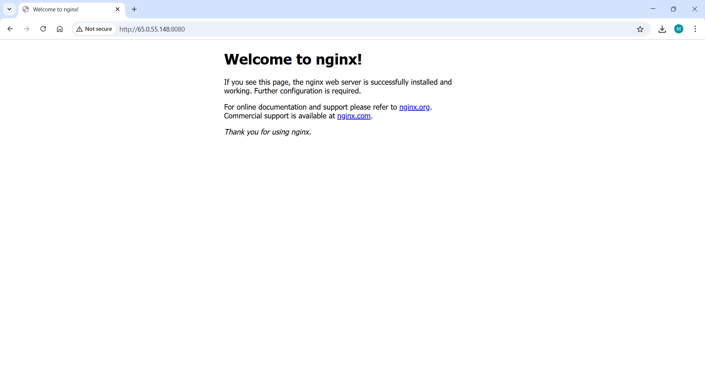
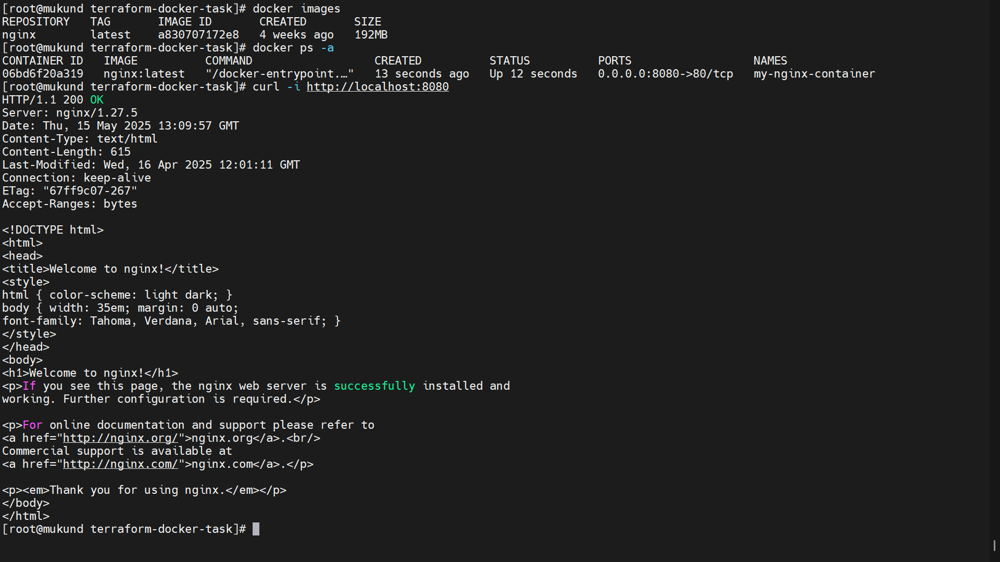

# Infrastructure as Code with Terraform & Docker
## Task-3 
---
## Objective
Provision a Docker container using Terraform on an AWS EC2 (Amazon Linux 2) instance, demonstrating Infrastructure as Code (IaC) concepts.

---

## Tech Stack

-  Platform: AWS EC2
-  Docker v25.0.8
-  Terraform v1.8.2
-  NGINX Docker Image
-  Security Group: TCP `8080` open for external access

---

## Project Files

| File Name              | Description                               |
|------------------------|-------------------------------------------|
| main.tf                | Terraform config for Docker & NGINX       |
| terraform.log          | Output log of Terraform Apply             |
| terraform_destroy.log  | Output log of Terraform Destroy           |
| screenshot-nginx.png   | Browser screenshot showing NGINX Running  |
| screenshot-docker.png  | Terminal showing Docker Container         |
| README.md              | This file                                 |

---
## Steps Performed

1.  Installed Docker and Terraform on EC2
2.  Wrote a Terraform config (`main.tf`) using kreuzwerker/docker provider
3.  Initialized Terraform using `terraform init`
4.  Planned infrastructure with `terraform plan`
5.  Applied config using `terraform apply` (ran nginx on port 8080)
6.  Verified browser access to `http://<ec2-ip>:8080`
7.  Destroyed infrastructure using `terraform destroy`

---

##  Screenshots

### NGINX Running in Browser



### Docker Container Running



---

## How to Run This Yourself

1. SSH into your EC2 instance
2. Install Docker & Terraform (commands in this repo)
3. Clone this repo:
```bash
git clone https://github.com/mukund-p/devops-task-3.git
cd devops-task-3
```
4. Run:
```bash
terraform init
terraform apply
```
5. Open browser: `http://<ec2-ip>:8080`

To clean up:
```bash
terraform destroy
```


# 📘 Interview Questions & Answers – Terraform & IaC

### 1. What is IaC?
**IaC (Infrastructure as Code)** is the process of managing and provisioning infrastructure using configuration files instead of manual processes.  
Tools like **Terraform** allow you to write infrastructure setups (servers, containers, etc.) as code, ensuring version control, repeatability, and automation.

---

### 2. How does Terraform work?
Terraform works in three main steps:
1. **Write**: Define infrastructure in `.tf` files using HashiCorp Configuration Language (HCL).
2. **Plan**: Preview changes with `terraform plan`.
3. **Apply**: Create/update infrastructure with `terraform apply`.

It uses **providers** to interact with cloud or infrastructure platforms (like Docker, AWS, etc.).

---

### 3. What is Terraform state file?
Terraform uses a file called `terraform.tfstate` to track the real infrastructure it has provisioned.  
- It maps resources defined in code to their actual state in the cloud or system.
- It helps Terraform know what to create, update, or destroy.
- Should be securely stored, especially in team environments (e.g., remote state with S3 and locking with DynamoDB).

---

### 4. Difference between apply and plan
| Command | Purpose |
|---------|---------|
| `terraform plan` | Shows what changes will be made without applying them. Used for verification. |
| `terraform apply` | Actually makes the infrastructure changes and provisions resources. |

---

### 5. What are Terraform providers?
**Providers** are plugins that allow Terraform to interact with APIs of cloud platforms or services.  
Examples:
- `docker` provider (for containers)
- `aws` provider (for AWS infrastructure)
- `azurerm`, `google`, etc.

Each provider requires authentication and configuration.

---

### 6. What is resource dependency?
Terraform understands dependencies between resources automatically using references.  
For example:
```hcl
resource "docker_image" "nginx" {
  name = "nginx:latest"
}

resource "docker_container" "nginx" {
  image = docker_image.nginx.latest
}
```
The container depends on the image, and Terraform ensures correct creation order.

---

### 7. How do you handle secret variables?
Sensitive data (like passwords, API keys) should **not be hardcoded**. You can:
- Use **Terraform variables** marked as `sensitive = true`
- Store secrets in environment variables or secret managers
- Use `.tfvars` files (avoid committing them)
- Integrate with tools like AWS Secrets Manager, Vault

---

### 8. Explain the benefits of Terraform.
- **Platform Agnostic**: Works with multiple providers.
- **IaC Support**: Infrastructure is versioned and repeatable.
- **Execution Plan**: Preview before applying.
- **Resource Graph**: Understand dependencies.
- **Automation**: Easily integrates with CI/CD tools.
